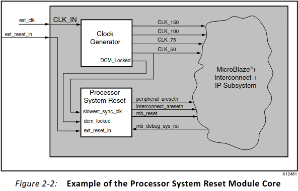
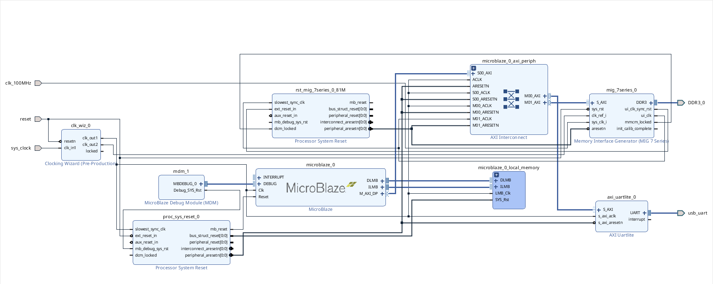

# IP MIG 7 Series

The practical work is focused on testing and verifying the operation of DDR memory on the Arty S7 FPGA board (Xilinx 7 Series).

The main goals and content of the work include:

    Verifying that the DDR memory installed on the board actually works.

    Learning how to configure and set up the DDR interface using the MIG IP core.

    Running and using the provided SDK Memory Tests application for basic DDR testing.

    Gaining practical experience creating a project in Vivado, setting up a Block Design, and integrating the DDR controller.

For this, we’ll need several other IP blocks — let’s briefly go over them.

## Processor System Reset

This is a special IP block from Xilinx designed for reliable reset signal management (reset) — especially when using processors (like MicroBlaze or Zynq), DDR, AXI peripherals, or multiple clock domains.

One (proc_sys_reset_0) for MicroBlaze, the other(rst_mig_7series_0_81M) for MIG.

For more information on how it works, you can refer to the 
### Processor System Reset Module v5.0 Product Guide (PG164).

## Clocking Wizard v6.0

Clocking Wizard v6.0 is an IP core from Xilinx that:

Allows you to generate one or more clock signals from a single input clock (e.g., an external 100 MHz source).

Utilizes MMCM or PLL resources inside the FPGA.

Supports:

    Frequency, phase, and duty cycle configuration for each output.

    Clock buffering (BUFG) and control over reset/enable.

    An optional Phase Alignment feature for precise synchronization.

Can be used to create clocks for logic, memory (MIG), interfaces (AXI), processors (like MicroBlaze), and other subsystems.

This is a fairly complex IP block and should be studied separately.

For detailed information, refer to the 
### Clocking Wizard LogiCORE IP Product Guide (PG065).

## MicroBlaze

A programmable 32-bit soft-core CPU developed by Xilinx, implemented entirely in FPGA logic. It follows a RISC architecture, supports AXI interfaces, 
and can be customized to meet specific project requirements.

Related to it:

    Debug module for MicroBlaze Soft Processor
    A module that enables debugging features for the MicroBlaze processor (e.g., breakpoints, stepping, memory inspection via JTAG).

    microblaze_0_local_memory
    A local memory block (usually implemented using BRAM) that serves as internal memory directly connected to the MicroBlaze core for fast access.

### We will cover this IP block in a separate topic.

## AXI Interconnect 

The AXI Interconnect IP connects one or more AXI memory-mapped master devices to one or more AXI memory-mapped slave devices. It manages data flow, addressing, and arbitration between masters and slaves in an AXI-based system.

### We will also cover it in the topic on the AXI interface.

## UART for AXI Interface

    UART is a standard serial communication protocol (asynchronous, with start/stop bits, etc.).

    A Generic UART with an AXI interface is a hardware module that implements this UART protocol at the physical data transmission and reception level.

    The AXI interface is used for interaction with the processor or logic inside the FPGA — through the AXI bus, the processor reads and writes UART registers (such as transmit and receive buffers, baud rate settings, status registers).

In other words, the UART protocol runs externally on the UART lines, while inside the FPGA the module is controlled via AXI.
Why is UART needed in a DDR project on FPGA?

    Debugging and monitoring

    Data exchange with a PC

    Control and configuration

    Interface for user applications

## Memory Interface Generator

This Memory Interface Generator is a simple menu driven tool to generate advanced memory interfaces. This tool generates HDL and pin placement constraints that will help you design your application. Kintex-7 supports DDR3 SDRAM, DDR2 SDRAM, LPDDR2 SDRAM, QDR II+ SRAM, RLDRAMII and RLDRAMIII. Virtex-7 supports DDR3 SDRAM, DDR2 SDRAM, LPDDR2 SDRAM, QDR II+ SRAM, RLDRAMII and RLDRAMIII. Artix-7 supports DDR3 SDRAM, DDR2 SDRAM and LPDDR2 SDRAM. Zynq supports DDR3 SDRAM, DDR2 SDRAM and LPDDR2 SDRAM

To correctly configure the MIG 7 IP core, we will refer to the Arty S7 Reference Manual:

3 DDR3L Memory

[Arty S7](https://digilent.com/reference/programmable-logic/arty-s7/reference-manual)

Table 3.1. DDR3L settings for the Arty S7 lists all the main parameters that we will use.

Here is what our completed block design looks like:

After the Block Design is generated, proceed to:
File → Export → Export Hardware

Then open SDK via:
File → Launch SDK

## What's SDK?

In simple terms:

    Imagine you have built a hardware platform (for example, on an FPGA with a MicroBlaze or Zynq processor).

    Now you need to write programs that will run on that processor.

    The SDK (Software Development Kit) is a special software (or set of tools) that helps you write, compile, debug, and load these programs onto the processor.

What’s included in the SDK?

    Code editor — where you write your programs.

    Compiler — which converts your code into machine language for the FPGA processor.

    Debugger — to find and fix errors in your code.

    Tools to load programs onto the hardware platform.

    Often it includes example code and libraries to simplify development.

### In SDK, "File → New → Application Project" means:

You are creating a new software project — a container for your application code that will run on the FPGA’s embedded processor (like MicroBlaze or Zynq).

#### What is OS Platform?
It refers to the operating system or runtime environment that your application will run on, on the embedded processor inside the FPGA.

Common options:

    Standalone (no OS)

        The application runs without an operating system (bare-metal).

        Typically used for simple programs that directly control the hardware.

        Ideal for small embedded systems or applications requiring real-time response.

    FreeRTOS

        A lightweight, open-source real-time operating system for microcontrollers and embedded systems.

        Supports tasks, priorities, timers, synchronization, etc.

        Good choice if you need multitasking without the overhead of a full OS.

    Linux (PetaLinux)

        A full-featured Linux OS customized for FPGA platforms.

        Suitable for complex applications requiring a file system, networking, or advanced services.

        Requires more hardware resources and configuration effort.

#### What does Target Hardware mean in SDK?

Target Hardware refers to the hardware platform your software project will run on.
Simply put:

It describes what hardware your program will execute on, including:

    The type and configuration of the processor (e.g., MicroBlaze or Zynq),

    Bus connections (e.g., AXI interconnects and peripherals),

    Clock frequencies,

    Memory,

    Connected IP cores (UART, Timers, GPIOs, etc.).

What are Hardware Platforms in SDK or Vitis?

The Hardware Platforms section lists all the available hardware platform files (usually .xsa, formerly .hdf) in your workspace. These files are generated from Vivado and contain:

    The full hardware description,

    The bitstream (if exported with it),

    Configuration for the processor and peripherals,

    And are used to generate the Board Support Package (BSP) — drivers and libraries for your code.

#### What is a Board Support Package (BSP)?

The BSP is a set of low-level software components that provide hardware-specific support for your application to run on the target FPGA platform.
It includes:

    Drivers for IP cores
    (e.g., UART, AXI Timer, SPI, GPIO)

    Configuration headers

        xparameters.h: contains base addresses of peripherals

        Other headers like xgpio.h, xtmrctr.h, etc.

    Runtime environment

        Either Standalone or FreeRTOS, depending on your OS platform

    Startup code, linker scripts, and Makefiles
    To help build and run your application properly.

Why is BSP important?

    It abstracts the hardware — you can use drivers instead of manually handling memory-mapped registers.

    It is automatically generated from the .xsa file you exported from Vivado.

    Your application code depends on the BSP to build and interact with hardware.

#### What are Templates in SDK / Vitis?

Templates are ready-to-use sample applications you can select when creating a new Application Project.

What do they do?

Templates provide:

    Pre-written example code (like main.c)

    A working project structure

    Automatic inclusion of necessary drivers from the BSP

    Sample usage of hardware-related APIs

### We select "Memory Test".

 And we get a folder with ready-to-use C examples, including tests, headers, and all the necessary libraries.

 I will slightly modify the source code from the memory test template.
