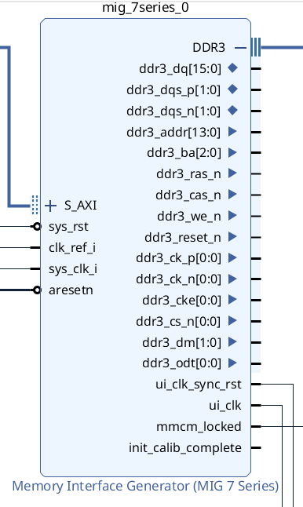

# MIG (Memory Interface Generator)

Data transfer in DDR3 is typically measured using the following units, depending on the context:

1. MT/s (Mega Transfers per Second)

This is the primary unit used to measure DDR memory bandwidth.
One transfer refers to a single data transmission on the rising or falling edge of the clock.
Since DDR = Double Data Rate, data is transferred twice per clock cycle of the memory bus.

Example:
DDR3-1600 operates at 800 MHz (bus frequency) but achieves 1600 MT/s because transfers occur on both clock edges (2 × 800 MHz).

2. MB/s or GB/s — Megabytes per second or Gigabytes per second

This represents the actual data bandwidth and is more useful for evaluating real-world data exchange rates.
It depends on:

    Transfer rate (MT/s)

    Data bus width (typically 64 bits = 8 bytes)

    Number of memory channels (if multiple chips are used)

Formula:
Bandwidth (bytes/s) = (MT/s) × (bus width in bytes)

## MIG (Memory Interface Generator) is an IP core generator from Xilinx designed for fast and correct creation of interfaces to external memory types such as DDR, DDR2, DDR3, DDR4, and LPDDR.

    - Memory controller (User Interface Layer) — manages command logic and data handling.

    - PHY (Physical Layer) — handles physical access to DDR pins, calibration, and delay management.

- PHY (Physical Layer)
This is the "low-level" logic that directly controls DDR signals (DQ, DQS, address, command lines). It operates at a high frequency—often the full DDR clock rate.

- Controller / User Interface
This is the logic you interact with as a user in your project (e.g., AXI interface, read/write commands). It can run at a slower frequency than the PHY.

In a DDR memory interface, the PHY (physical layer) and the memory controller (User Interface) operate at different clock frequencies, and a defined clock ratio may exist between them.

This IP core allows FPGA logic to interface with external DDR3 or DDR2 memory.
It supports an AXI4 Slave interface, meaning your logic can connect as a master to the MIG and send read/write commands via the AXI interface.

## Clock Period 

Inside the MIG (Memory Interface Generator from Xilinx), a PLL (Phase-Locked Loop) or MMCM (Mixed-Mode Clock Manager) is used. These components:

    Accept an external clock input (the one you provide to MIG — e.g., a 100 MHz crystal oscillator);

    Generate the required internal clock frequencies for various parts of the DDR controller;

MIG also generates synchronized, buffered output clocks that can be used in your design, such as:

    ui_clk — the user logic clock (typically half the DDR frequency);

    clk_ref_i — the reference input clock;

    clk_mem — the memory clock output used by the PHY to drive external DDR memory;

1. sys_clk_i — System Clock

This is the clock input provided to the MIG memory controller (UI – User Interface).

It synchronizes the internal logic of the MIG, the user interface (ui_clk), and the control FSM (e.g., for calibration).

Its frequency depends on the platform and performance requirements, and is often 100 MHz.

2. clk_ref_i — Reference Clock for PHY

This clock is connected to the PHY layer of the DDR (physical interface) and is used by the MMCM/PLL inside the MIG to generate high-frequency clocks required by the DDR3 memory itself.

It is mandatory for correct operation of the PHY.

A frequency of 200 MHz or higher is typically required, because:

DDR3 operates at high data rates (e.g., 800 Mbps requires a 400 MHz clock).

clk_ref_i must provide precise clock generation with minimal jitter.

### PHY to Controller Clock Ratio

Purpose: Defines the frequency ratio between the PHY (physical interface) and the memory controller (user logic).

    2:1 — The controller operates at half the PHY frequency.
    This lowers the timing requirements for user logic (lower clock speed) and reduces latency.

    4:1 — The controller operates at one-fourth the PHY frequency.
    This is used for maximum data rates (e.g., DDR3-1866 and above), but increases latency.

### Number of Bank Machines

DDR3 Memory Structure
1. Ranks

    A rank is a set of memory chips that operate in parallel and share the same set of control signals (such as CS – Chip Select).

    All chips in a rank respond simultaneously, but each provides different bits of data. For example:

        8 chips × 8 bits = a 64-bit data bus.

    A memory module (DIMM) can have 1, 2, or 4 ranks.

    Types of ranks:

        Single-rank – one set of chips,

        Dual-rank – two sets,

        Quad-rank – four sets.

The memory controller can only access one rank at a time.

2. Banks

    Each DDR3 chip (IC) contains multiple banks — typically 8 banks.

    These are independent storage blocks, allowing interleaved operations (e.g., reading from one while another is being prepared).

3. Rows and Columns

    Each bank is a 2D matrix of memory cells: rows × columns.

    To read or write data, the following steps occur:

        Activate a row → it gets copied into a row buffer.

        Read or write columns from the active row.

        Precharge the bank (close the row) before a new operation can begin.

    Typical configuration might include:

        16K rows (2¹⁴),

        1K columns (2¹⁰),

        Each cell stores 8 bits (1 byte).

The DDR3 address is divided into the following fields:

[ rank | bank | row | column | byte ]



### MIG DDR3 Signal List and Descriptions

```m
Signal                      Description

ddr3_dq            [15:0]	Bidirectional data bus. Used to transfer read and write data. For x16 DDR3 chips → ddr3_dq [15:0] → 16 data lines.

ddr3_dqs_p / dqs_n [1:0]	Differential Data Strobe signals. Used by the memory to synchronize data transfers on the dq bus.

ddr3_dm            [1:0]	Data Mask. Used during writes to mask individual bytes. One dm per byte. Since ddr3_dq [15:0] is 2 bytes, there are 2 dm lines. 
                            A masked byte is ignored during writes.

ddr3_addr          [13:0]	Address bus. Used to specify row or column addresses depending on the command.

ddr3_ba            [2:0]	Bank Address. Selects which bank the row/column address applies to. Typically 3 bits.

ddr3_ck_p / ck_n   [0:0]	Differential clock signal for DDR3 memory. Drives the memory’s primary clock.

ddr3_cs_n          [0:0]	Chip Select. Active-low signal that selects the DDR3 memory chip.

ddr3_ras_n	                Row Address Strobe. Active-low signal. Indicates that the address bus contains a row address.

ddr3_cas_n	                Column Address Strobe. Active-low signal. Indicates that the address bus contains a column address.

ddr3_we_n	                Write Enable. Active-low signal. Used along with ras_n and cas_n to define memory commands.

ddr3_reset_n	            Global reset for DDR3. Active-low. Drives the memory into reset when held low.

ddr3_odt	       [0:0]    On-Die Termination. Enables/disables internal termination resistors inside the DDR3 chip.

ddr3_cke	       [0:0]    Clock Enable. Active-high. Controls whether the DDR3 chip is in active or power-down mode.

sys_clk_i                   System clock input. This is the primary clock input to the MIG IP. Used internally by MMCM/PLL to generate all necessary clocks 
                            (clk_mem, ui_clk, clk_ref, etc.). It does not directly clock the DDR3 memory.

clk_ref_i                   Reference clock for IDELAYCTRL. Used to calibrate delay elements (IDELAY) for timing adjustment on input/output lines. Typical values:  
                            200 MHz or 300 MHz. Required for proper MIG calibration.

sys_rst                     System reset input. Global reset for MIG.It is usually driven by a button, an external signal, or a system reset input connected to the 
                            board (for example, from an external controller or a reset pin).

aresetn                     User logic reset (UI reset).This reset is provided by the Processor System Reset block.
                            It is synchronized with ui_clk (the internal output clock of the MIG).It applies to the logic on the user side,i.e., logic that reads from or writes to the MIG through AXI or another interface.

ui_clk                      User Interface Clock. Main clock for user logic. Generated by MIG. All AXI or native user logic connected to MIG must operate in this  
                            clock domain.

ui_addn_clk_0               Additional user clock (output). One of up to 6 additional user clocks (ui_addn_clk_0 to ui_addn_clk_5) generated from the same MMCM as 
                            ui_clk.

ui_clk_sync_rst             Synchronous reset in the ui_clk domain. Active-high. Asserted until MIG finishes calibration. Should be used to reset user logic driven 
                            by ui_clk.

mmcm_locked                 MMCM/PLL lock status (output). Indicates whether the internal MMCM/PLL has locked to the input clocks. If mmcm_locked == 0, the input  
                            clocks (sys_clk_i, clk_ref_i) may be unstable or incorrectly configured.

init_calib_complete         Memory ready (output). Goes high when memory initialization and calibration are successfully completed. At this point, the DDR3 memory 
                            is ready for use.
```
